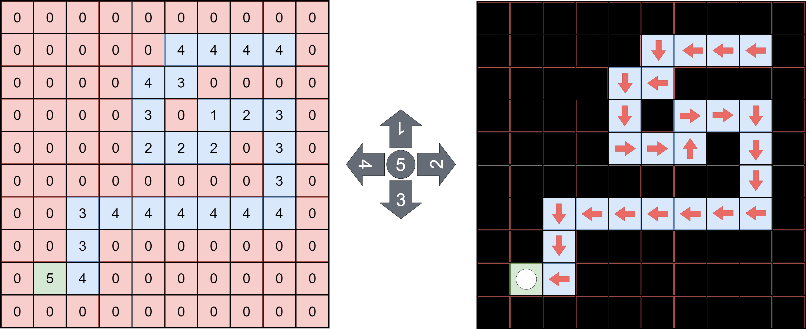
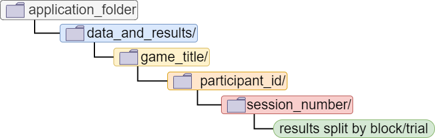
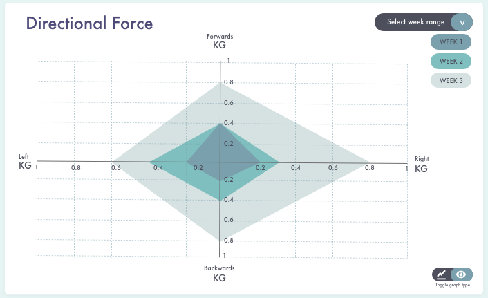
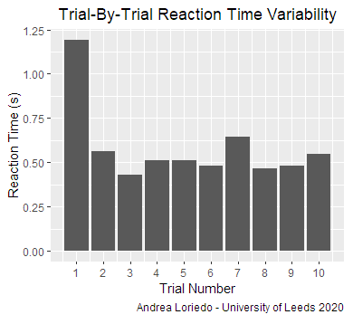
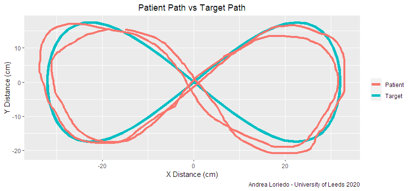
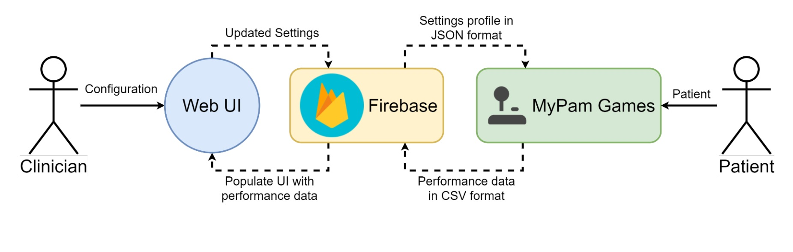

# MyPam Suite

> **Mechatronics and Robotics (MEng) Masters Project:** *Design and Development of a Gamified Exercise Battery for the MyPam Rehabilitation Robot*

> **Final Grade:** First Class Honours

A battery of three computer games aimed at the delivery of rehabilitation exercise following a stroke. Devised as an adjunct to the **MyPam** assistive robotic rehabilitation device, the virtual platform addresses the need for a robust system to track the patient’s progress throughout a well-scoped exercise regime. As the MyPam games target a vulnerable user-base, a strong focus was put on engagement and ease of use.


> Built in Unity v.2018.2.7f1

## The Tasks 🖥️
Each task was designed to address a different aspect of upper extremity function recovery:

- **Directional Force Magnitude:** The amount of force the patient can generate across the workspace in each direction.

- **Reaction Time:** Measured as the duration between the presentation of the stimulus and the patient's motor reaction, it indicates the degree of coordination between their sensory and motor system.

- **Path Accuracy:** Spatial Precision measured by comparing hand trajectory to a reference path that the patient is meant to trace and evaluating the cumulative movement error over the number of samples in the trial.

### 1. Maze Waddler - Force Assessment Task
The *“Maze Waddler”* game was designed to encourage the patient to exert forces onto the MyPam handle, guiding an animated penguin through a layered maze.


Each layer in the maze is procedurally generated from a visual grid as shown in the picture below, meaning that new blocks of levels can be easily designed and introduced to vary the difficulty and keep the game interesting. The same methodology was used to map the direction of the assistive forces to be provided by the robot across the workspace for each level.



Directional force is recorded to obtain information about the functional state of the different muscle groups involved in shoulder and elbow movement. The goal is to take the penguin through as many different levels in the maze as possible within a defined timeframe. The patient score would therefore reflect the degree to which the impaired limb can exert enough controlled force in a specific direction. 

### 2. Whack-A-Mole -  Reaction Time Assessment Task

The patient is invited to control a hammer with the objective to “whack” (or reach for) as many moles as possible as they randomly spawn in holes positioned along the workspace perimeter. 


To simplify gameplay, a “start zone” acting as a **Finite-State Machine** was defined in the centre of the play area, with a new mole only spawning when a patient has returned from their previous move. 

In this task, *Reaction Time* is quantified as the duration between the stimulus – the mole – being presented and the patient displacing the hammer outside of the start position.

### 3. "Traffic Jam" - Path Accuracy Assessment Task

A cursor indicates the exact position of the robotic end effector – the patient’s hand – within the workspace, and the player must move it to precisely guide a red car along a series of sinusoidal trajectories generated by an equation. 


Yellow taxis move along the reference trajectory at a fixed rate to promote continuous movement. If a crash occurs between the player and one of the taxis, the cars stop until the patient brings their car back up to speed, penalizing erratic or intermittent motion. This game provides a framework to measure the patient’s deviation from the ideal path and
hence quantify their spatial precision.

##  Task Flexibility 🛠️

Developed by [Jack Brookes](https://github.com/jackbrookes) at the *University of Leeds*, the  [Unity Experiment Framework](https://github.com/immersivecognition/unity-experiment-framework)
is a package for developing gamified experiments in Unity.

In the attempt to achieve the required flexibility in the way the system challenges stroke survivors, `UXF` was integrated into each of the tasks. This resulted into each game having a highly configurable structure and a data input/output system predisposed for remote clinician intervention. 

Stored in the `Streaming Assets` folder, the `.json` settings file for each game can hence be intuitively updated to alter in-game parameters, as exemplified in the `whack_a_mole.json.json` file shown below.

```json
{
    "view": "isometric",
    "number_of_trials": 10,
    "number_of_holes": 8,
    "mole_timeout": 5,
    "workspace_radius_cm": 20
}
```

Settings such as game view angle, workspace size and amount of assistance can therefore be altered by simply editing entries within the relative text file without requiring changing the source code. 

Similarly, the tilemaps to be loaded at runtime in order to generate each level in *"Maze Waddler"* are stored in the form of `2-dimensional arrays` in the relative `.json` settings file

## Data Output 📈
Aside from building a flexible data input system, major focus was put on creating a robust framework for data output to extract patient performance measurements.

The file input/output system in `UXF` was the tool of choice to organize the output data into a cascading folder structure split by tasks, participants, sessions and trials.


### Graphical Representation of Directional Force

### Reaction Time Variability Between Consecutive Trials


### Patient Trajectory vs Target Path over one trial in "Traffic Jam"

## Future Developments 💡
A future prospect worth mentioning is the possibility to host patient settings profiles and session results on an online database. The input and output formats of choice being respectively `.json` and `.csv`, data is suitably formatted for two-way communication between the game battery and a web-based physiotherapist UI mediated by a cloud hosted Realtime Database such as Google Firebase.


